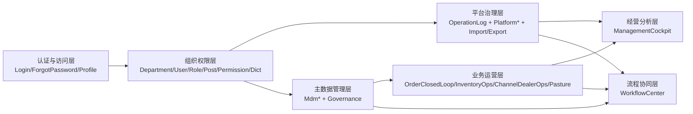
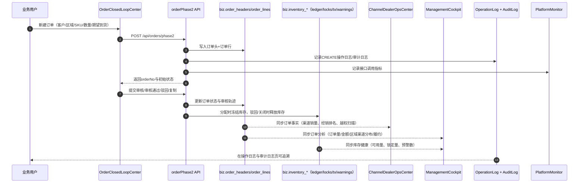
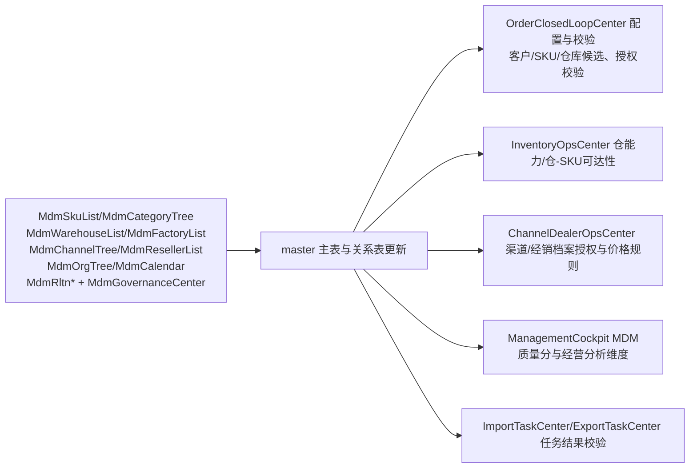
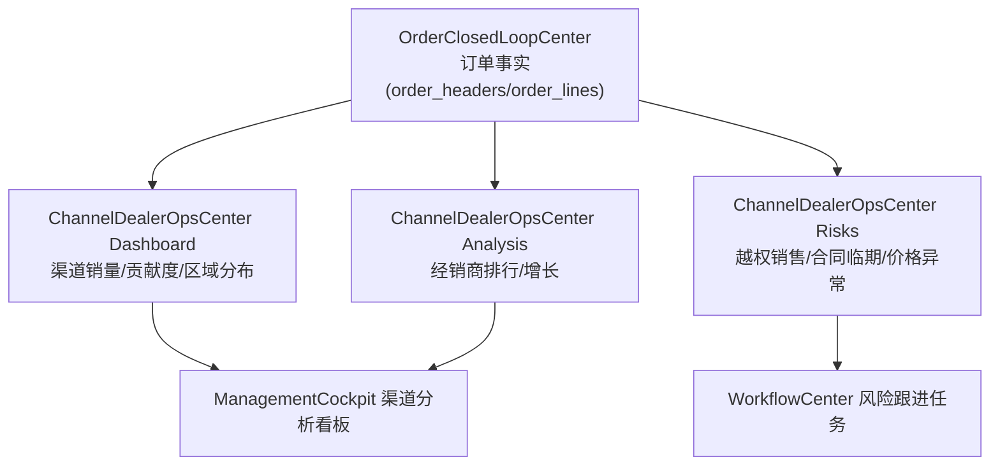
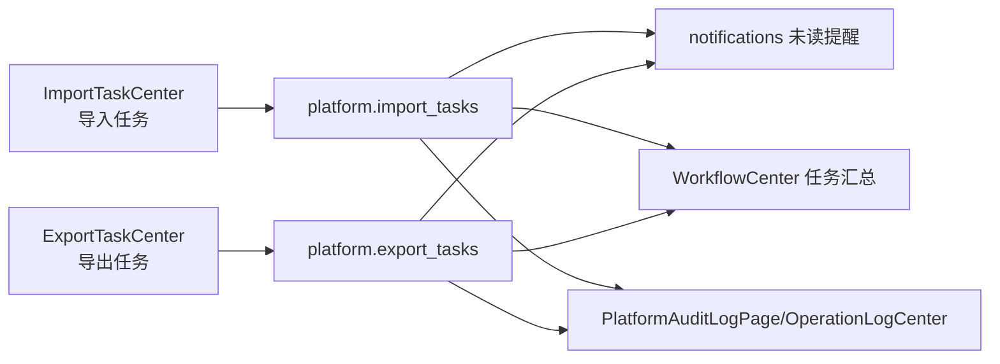
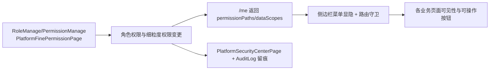

# 全系统页面业务逻辑流程图

更新时间：2026-04-13  
覆盖范围：`src/router/index.ts` 中已挂载页面 + `src/views/*.vue` 对应业务链路

## 1. 页面分层总览（全系统）

## 2. 全页面与数据域关系图

```mermaid
flowchart TB
    subgraph SYS["system 域（组织权限）"]
        s1["DepartmentManage"]
        s2["UserManage"]
        s3["RoleManage"]
        s4["PostManage"]
        s5["PermissionManage"]
        s6["DictCenter"]
    end

    subgraph MDM["master 域（主数据）"]
        m1["MdmSkuList"]
        m2["MdmResellerRelation"]
        m3["MdmCategoryTree"]
        m4["MdmWarehouseList"]
        m5["MdmFactoryList"]
        m6["MdmChannelTree"]
        m7["MdmResellerList"]
        m8["MdmOrgTree"]
        m9["MdmCalendar"]
        m10["MdmRltnWarehouseSku"]
        m11["MdmRltnOrgReseller"]
        m12["MdmRltnProductSku"]
        m13["MdmGovernanceCenter"]
    end

    subgraph BIZ["biz 域（业务）"]
        b1["OrderClosedLoopCenter"]
        b2["InventoryOpsCenter"]
        b3["ChannelDealerOpsCenter"]
        b4["PastureOverview"]
        b5["IntelligentOrdering（旧链路只读）"]
    end

    subgraph PLT["platform 域（平台）"]
        p1["OperationLogCenter"]
        p2["ImportTaskCenter"]
        p3["ExportTaskCenter"]
        p4["PlatformAuditLogPage"]
        p5["PlatformSecurityCenterPage"]
        p6["PlatformConfigCenterPage"]
        p7["PlatformArchiveStrategyPage"]
        p8["PlatformMonitorPage"]
        p9["PlatformFinePermissionPage"]
        p10["PlatformHealthViewPage"]
        p11["WorkflowCenter"]
    end

    subgraph ANA["分析域"]
        a1["ManagementCockpit"]
    end

    SYS --> MDM
    MDM --> BIZ
    BIZ --> ANA
    PLT --> ANA
    BIZ --> PLT
    MDM --> PLT
```

## 3. 订单创建与多页面同步（核心链路）

> 订单创建入口：`/intelligent-closed-loop`（`OrderClosedLoopCenter.vue`）

### 3.1 订单动作 -> 联动页面 -> 更新显示内容

| 订单动作 | 触发页面 | 同步页面 | 主要更新显示内容 |
|---|---|---|---|
| 新建订单 | `OrderClosedLoopCenter` | `OrderClosedLoopCenter`、`ManagementCockpit`、`ChannelDealerOpsCenter`、`OperationLogCenter`、`PlatformAuditLogPage`、`PlatformMonitorPage` | 新订单号、客户/区域/SKU明细、订单总量/金额、渠道销量贡献、审计记录、API调用统计 |
| 提交审核/审核 | `OrderClosedLoopCenter` | `OrderClosedLoopCenter`、`ManagementCockpit`、`OperationLogCenter` | 状态流转（草稿→待审→待分配/驳回）、状态分布指标、操作轨迹 |
| 自动/人工分配 | `OrderClosedLoopCenter` | `InventoryOpsCenter`、`ManagementCockpit`、`OrderClosedLoopCenter` | 库存锁定量、可用量变化、分配成功率、异常类型（库存不足/效期风险） |
| 履约流转/关闭 | `OrderClosedLoopCenter` | `InventoryOpsCenter`、`ManagementCockpit`、`ChannelDealerOpsCenter` | 锁释放、履约率、渠道到货与履约表现 |

## 4. MDM 主数据变更传播图（覆盖 MDM 全页面）

## 5. 渠道经营与订单事实联动图

## 6. 导入导出、通知、工作流联动图

## 7. 权限与菜单生效链路（全页面访问控制）

## 8. 全系统回归建议（按流程验收）

1. 订单链路：`新建 -> 提交 -> 审核 -> 分配 -> 履约/关闭`，每一步核对订单页、库存页、渠道页、驾驶舱、日志页。  
2. 主数据链路：在任一 `Mdm*` 页面改动关键主数据后，验证订单配置候选、库存可达性、渠道授权与驾驶舱维度是否同步。  
3. 平台链路：触发导入/导出任务后，核对任务中心、通知、工作流、审计日志、监控是否一致。  
4. 权限链路：调整角色权限后，验证菜单、路由、按钮权限及安全审计日志一致性。
