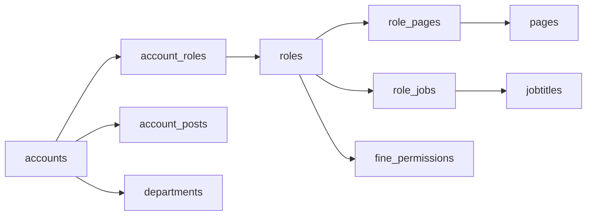
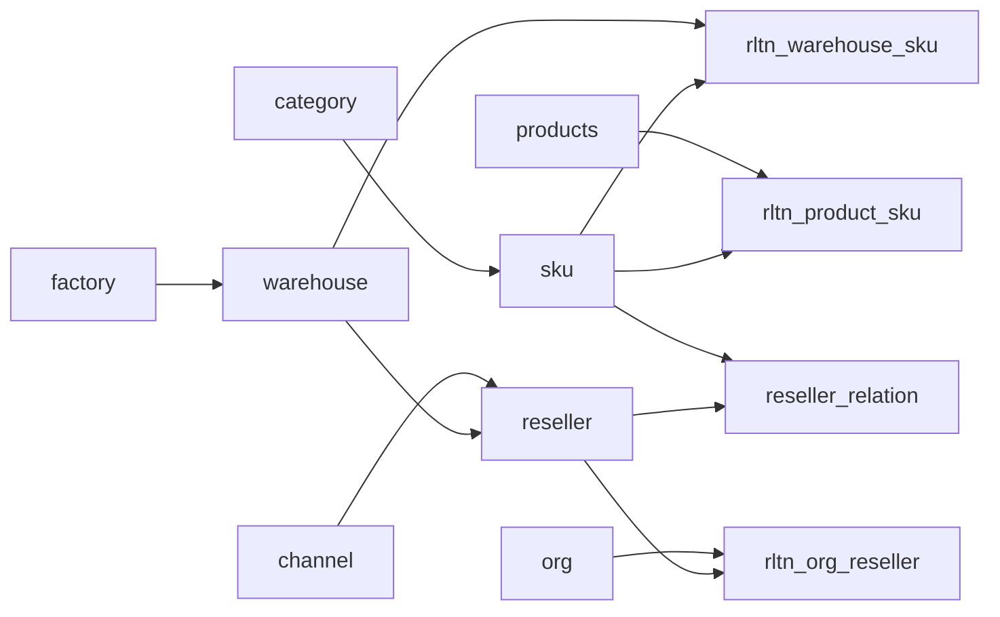
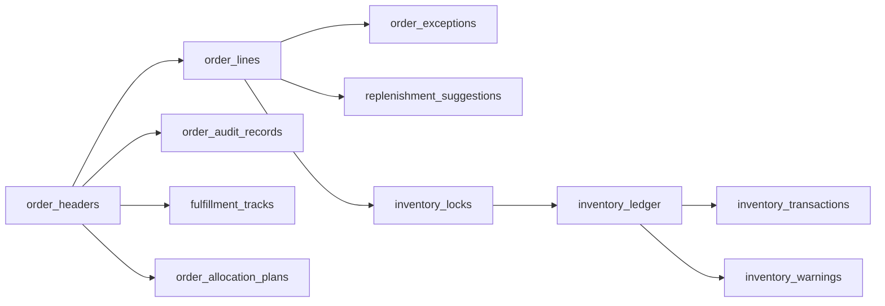
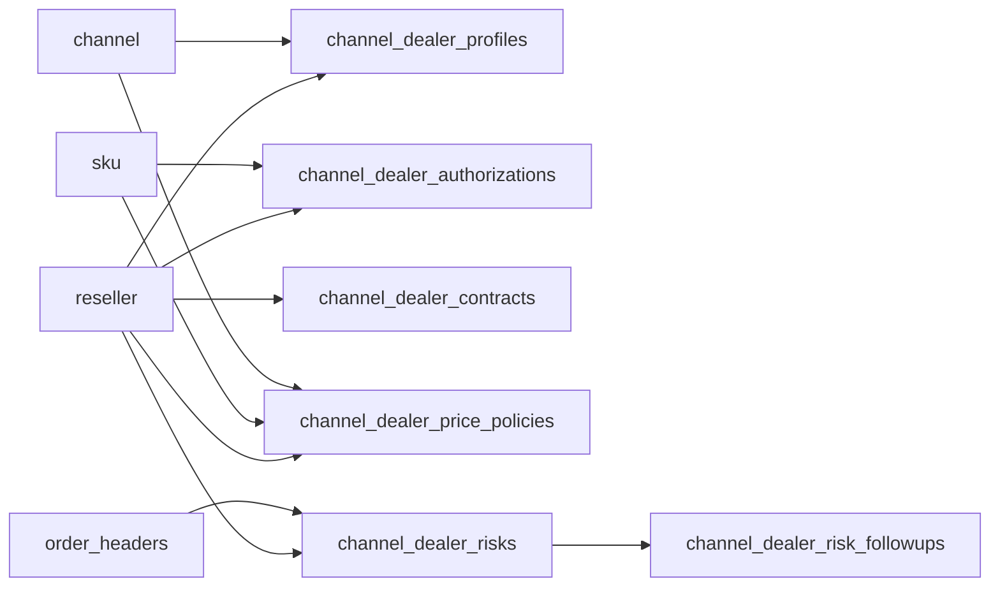
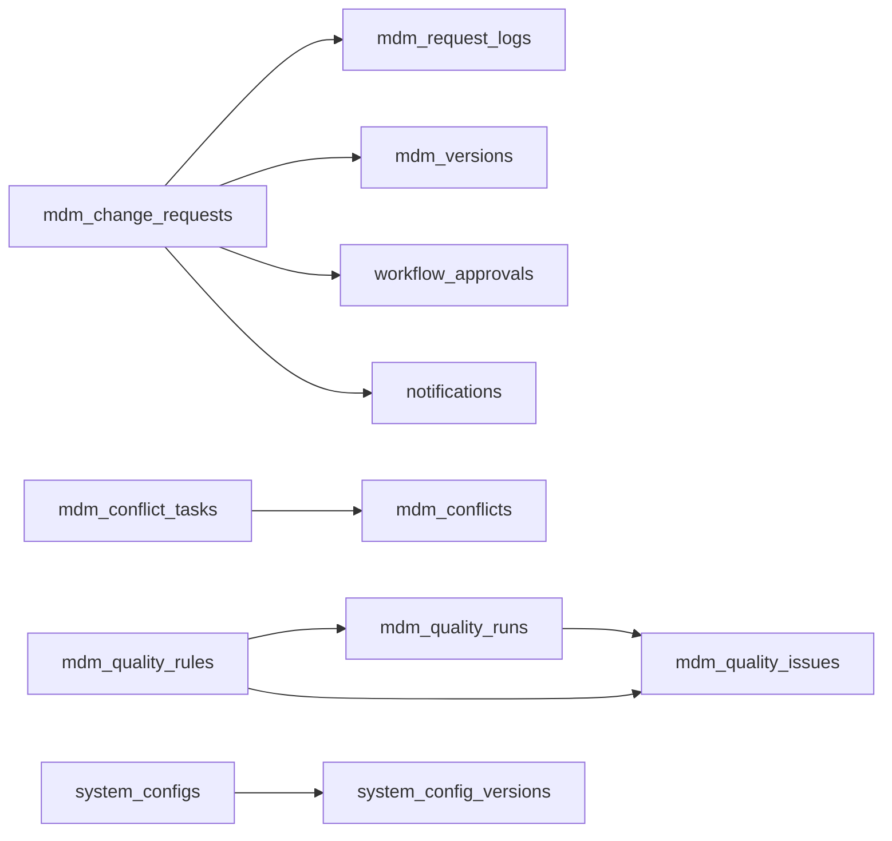

# 全量数据关联关系检索报告

更新时间：2026-04-14  
检索范围：`server/local-data/db.json`、`server/*.js`、`src/stores/appStore.ts`、现有联动文档

## 1. 一页结论

当前项目的数据关系已经形成了比较完整的四层结构：
- `system`：组织权限域，负责“谁能看、谁能做”
- `master`：主数据域，负责“基础对象是什么”
- `biz`：业务域，负责“订单、库存、渠道、调拨怎么流转”
- `platform`：平台域，负责“日志、任务、工作流、治理、报表怎么追溯”

全系统的主关联键主要分为三类：
- `*_id`：内部实体主键/关系键，如 `account_id`、`role_id`、`line_id`
- `*_code`：主数据业务编码键，如 `sku_code`、`warehouse_code`、`reseller_code`
- `*_no`：业务单据号，如 `order_no`、`transfer_no`、`request_no`

从“数据血缘”角度看，当前最核心的主链是：
- `system.accounts -> system.account_roles/account_posts -> roles/pages/jobtitles/departments`
- `master.sku/reseller/warehouse/channel/org/factory -> 各类关系表`
- `biz.order_headers -> biz.order_lines -> allocation/exception/track/lock/replenishment`
- `biz.inventory_ledger -> inventory_transactions/inventory_warnings/inventory_locks`
- `platform.mdm_change_requests -> logs/versions/issues/conflicts`
- `platform.workflow_* / notifications / operation_logs / security_logs` 对业务过程做追踪

同时也存在几条需要注意的“并行/派生链”：
- `biz.orders` 是旧订单链路，和 `biz.order_headers/order_lines` 并存
- `biz.inventory_stock` 更像库存汇总快照，`biz.inventory_ledger` 才是批次级事实表
- `biz.channel_dealer_authorizations` 与 `master.reseller_relation` 存在镜像/派生关系
- `platform.workflow_*` 目前既有业务关联，也有示例种子数据

## 2. 当前数据域规模

### 2.1 system 域

| 集合 | 当前行数 |
| :--- | ---: |
| departments | 6 |
| jobtitles | 5 |
| pages | 59 |
| roles | 5 |
| role_pages | 122 |
| role_jobs | 5 |
| accounts | 6 |
| account_roles | 6 |
| account_posts | 6 |

### 2.2 master 域

| 集合 | 当前行数 |
| :--- | ---: |
| category | 14 |
| warehouse | 21 |
| factory | 6 |
| channel | 18 |
| reseller | 19 |
| org | 14 |
| sku | 27 |
| reseller_relation | 207 |
| rltn_warehouse_sku | 205 |
| rltn_org_reseller | 19 |
| rltn_product_sku | 25 |
| calendar | 365 |

### 2.3 biz 域

| 集合 | 当前行数 |
| :--- | ---: |
| products | 25 |
| orders | 260 |
| order_headers | 10 |
| order_lines | 14 |
| order_audit_records | 23 |
| order_allocation_plans | 8 |
| order_exceptions | 3 |
| replenishment_suggestions | 4 |
| fulfillment_tracks | 19 |
| inventory_stock | 200 |
| inventory_ledger | 202 |
| inventory_transactions | 219 |
| inventory_warnings | 265 |
| inventory_locks | 10 |
| transfer_orders | 6 |
| transfer_tracks | 18 |
| warehouse_capabilities | 21 |
| channel_dealer_profiles | 19 |
| channel_dealer_authorizations | 207 |
| channel_dealer_contracts | 19 |
| channel_dealer_price_policies | 208 |
| channel_dealer_risks | 8 |
| channel_dealer_risk_followups | 1 |

### 2.4 platform 域

| 集合 | 当前行数 |
| :--- | ---: |
| dict_types | 5 |
| dict_items | 16 |
| operation_logs | 27 |
| import_tasks | 2 |
| export_tasks | 4 |
| notifications | 9 |
| task_runs | 2 |
| mdm_change_requests | 2 |
| mdm_request_logs | 5 |
| mdm_versions | 1 |
| mdm_quality_rules | 5 |
| mdm_quality_runs | 1 |
| mdm_quality_issues | 1 |
| mdm_conflict_tasks | 18 |
| mdm_conflicts | 18 |
| workflow_todos | 12 |
| workflow_approvals | 6 |
| workflow_messages | 5 |
| workflow_tasks | 2 |
| workflow_reminders | 1 |
| workflow_timeout_rules | 4 |
| management_reports | 3 |
| security_logs | 6 |
| system_configs | 3 |
| system_config_versions | 3 |
| archive_policies | 3 |
| archive_jobs | 0 |
| fine_permissions | 20 |

## 3. 关联规则总表

### 3.1 组织权限主链

- `system.jobtitles.job_department_id -> system.departments.id`
- `system.pages.parent_id -> system.pages.id`
- `system.role_pages.role_id -> system.roles.id`
- `system.role_pages.page_id -> system.pages.id`
- `system.role_jobs.role_id -> system.roles.id`
- `system.role_jobs.job_id -> system.jobtitles.id`
- `system.accounts.department_id -> system.departments.id`
- `system.account_roles.account_id -> system.accounts.id`
- `system.account_roles.role_id -> system.roles.id`
- `system.account_posts.account_id -> system.accounts.id`
- `system.account_posts.job_id -> system.jobtitles.id`
- `platform.fine_permissions.role_id -> system.roles.id`
- `platform.security_logs.user_id -> system.accounts.id`
- `platform.operation_logs.operator_id -> system.accounts.id`

这条链的作用是：从“用户”出发，能追溯到部门、岗位、角色、页面权限和精细化权限配置。

### 3.2 主数据主链

- `master.warehouse.factory_code -> master.factory.factory_code`
- `master.reseller.lv1_channel_code -> master.channel.channel_code`
- `master.reseller.lv2_channel_code -> master.channel.channel_code`
- `master.reseller.lv3_channel_code -> master.channel.channel_code`
- `master.reseller.default_warehouse_code -> master.warehouse.warehouse_code`
- `master.sku.category_code -> master.category.category_code`
- `master.reseller_relation.sku_code -> master.sku.sku_code`
- `master.reseller_relation.reseller_code -> master.reseller.reseller_code`
- `master.rltn_warehouse_sku.warehouse_code -> master.warehouse.warehouse_code`
- `master.rltn_warehouse_sku.sku_code -> master.sku.sku_code`
- `master.rltn_org_reseller.org_code -> master.org.org_code`
- `master.rltn_org_reseller.reseller_code -> master.reseller.reseller_code`
- `master.rltn_product_sku.product_code -> biz.products.product_code`
- `master.rltn_product_sku.sku_code -> master.sku.sku_code`

这条链定义了“主对象”和“对象之间的授权/覆盖/映射关系”。

### 3.3 订单与履约主链

- `biz.order_headers.customer_code -> master.reseller.reseller_code`
- `biz.order_headers.channel_code -> master.channel.channel_code`
- `biz.order_lines.order_no -> biz.order_headers.order_no`
- `biz.order_lines.sku_code -> master.sku.sku_code`
- `biz.order_lines.suggested_warehouse_code -> master.warehouse.warehouse_code`
- `biz.order_audit_records.order_no -> biz.order_headers.order_no`
- `biz.order_allocation_plans.order_no -> biz.order_headers.order_no`
- `biz.order_exceptions.order_no -> biz.order_headers.order_no`
- `biz.order_exceptions.line_id -> biz.order_lines.id`
- `biz.replenishment_suggestions.order_no -> biz.order_headers.order_no`
- `biz.replenishment_suggestions.line_id -> biz.order_lines.id`
- `biz.replenishment_suggestions.sku_code -> master.sku.sku_code`
- `biz.replenishment_suggestions.source_warehouse_code -> master.warehouse.warehouse_code`
- `biz.replenishment_suggestions.target_warehouse_code -> master.warehouse.warehouse_code`
- `biz.fulfillment_tracks.order_no -> biz.order_headers.order_no`

这条链定义了“订单从主单到明细，再到审核、分配、异常、补货、履约”的全过程。

### 3.4 库存与调拨主链

- `biz.inventory_stock.warehouse_code -> master.warehouse.warehouse_code`
- `biz.inventory_stock.sku_code -> master.sku.sku_code`
- `biz.inventory_ledger.warehouse_code -> master.warehouse.warehouse_code`
- `biz.inventory_ledger.sku_code -> master.sku.sku_code`
- `biz.inventory_transactions.warehouse_code -> master.warehouse.warehouse_code`
- `biz.inventory_transactions.sku_code -> master.sku.sku_code`
- `biz.inventory_transactions.source_doc_no -> order_no/transfer_no 等业务单据`
- `biz.inventory_warnings.warehouse_code -> master.warehouse.warehouse_code`
- `biz.inventory_warnings.sku_code -> master.sku.sku_code`
- `biz.inventory_locks.order_no -> biz.order_headers.order_no`
- `biz.inventory_locks.line_id -> biz.order_lines.id`
- `biz.inventory_locks.warehouse_code + sku_code + batch_no -> biz.inventory_ledger`
- `biz.transfer_orders.out_warehouse_code -> master.warehouse.warehouse_code`
- `biz.transfer_orders.in_warehouse_code -> master.warehouse.warehouse_code`
- `biz.transfer_orders.sku_code -> master.sku.sku_code`
- `biz.transfer_orders.batch_no -> biz.inventory_ledger.batch_no`
- `biz.transfer_tracks.transfer_no -> biz.transfer_orders.transfer_no`
- `biz.warehouse_capabilities.warehouse_code -> master.warehouse.warehouse_code`

这条链定义了“仓、货、批次、锁定、交易、预警、调拨”的运营主线。

### 3.5 渠道经营主链

- `biz.channel_dealer_profiles.reseller_code -> master.reseller.reseller_code`
- `biz.channel_dealer_profiles.lv1/2/3_channel_code -> master.channel.channel_code`
- `biz.channel_dealer_profiles.default_warehouse_code -> master.warehouse.warehouse_code`
- `biz.channel_dealer_authorizations.reseller_code -> master.reseller.reseller_code`
- `biz.channel_dealer_authorizations.sku_code -> master.sku.sku_code`
- `biz.channel_dealer_contracts.reseller_code -> master.reseller.reseller_code`
- `biz.channel_dealer_price_policies.reseller_code -> master.reseller.reseller_code`
- `biz.channel_dealer_price_policies.channel_code -> master.channel.channel_code`
- `biz.channel_dealer_price_policies.sku_code -> master.sku.sku_code`
- `biz.channel_dealer_risks.reseller_code -> master.reseller.reseller_code`
- `biz.channel_dealer_risks.order_refs[] -> biz.order_headers.order_no`
- `biz.channel_dealer_risk_followups.risk_id -> biz.channel_dealer_risks.id`

这条链定义了“经销商画像、授权、合同、价格、风险”的经营关系。

### 3.6 平台治理与工作流主链

- `platform.dict_items.dict_type_code -> platform.dict_types.dict_type_code`
- `platform.import_tasks.operator_id -> system.accounts.id`
- `platform.export_tasks.operator_id -> system.accounts.id`
- `platform.notifications.receiver_id -> system.accounts.id`
- `platform.notifications.biz_type + biz_id -> ORDER / TRANSFER / MDM_REQUEST / TASK 等业务对象`
- `platform.mdm_change_requests.target_id/target_code -> master 域目标对象`
- `platform.mdm_request_logs.request_id -> platform.mdm_change_requests.id`
- `platform.mdm_request_logs.request_no -> platform.mdm_change_requests.request_no`
- `platform.mdm_versions.request_id -> platform.mdm_change_requests.id`
- `platform.mdm_versions.request_no -> platform.mdm_change_requests.request_no`
- `platform.mdm_quality_issues.run_id -> platform.mdm_quality_runs.id`
- `platform.mdm_quality_issues.rule_id -> platform.mdm_quality_rules.id`
- `platform.mdm_quality_issues.target_id/target_code -> master 域目标对象`
- `platform.mdm_conflicts.task_id -> platform.mdm_conflict_tasks.id`
- `platform.mdm_conflicts.target_id/target_code -> master 域目标对象`
- `platform.workflow_todos.assignee_id -> system.accounts.id`
- `platform.workflow_todos.approval_id -> platform.workflow_approvals.id`
- `platform.workflow_todos.task_id -> platform.workflow_tasks.id`
- `platform.workflow_todos.biz_type + biz_id -> ORDER / TRANSFER / MDM / TASK 等业务对象`
- `platform.workflow_approvals.applicant_id -> system.accounts.id`
- `platform.workflow_approvals.reviewer_id -> system.accounts.id`
- `platform.workflow_approvals.biz_type + biz_id -> 业务对象`
- `platform.workflow_messages.receiver_id -> system.accounts.id`
- `platform.workflow_messages.biz_type + biz_id -> 业务对象`
- `platform.workflow_tasks.owner_id -> system.accounts.id`
- `platform.workflow_reminders.todo_id -> platform.workflow_todos.id`
- `platform.workflow_reminders.operator_id -> system.accounts.id`
- `platform.system_config_versions.config_id -> platform.system_configs.id`
- `platform.system_config_versions.config_code -> platform.system_configs.config_code`

这条链定义了“日志、任务、通知、工作流、配置版本、治理流程”的平台级关联。

## 4. 核心血缘链路

### 4.1 账户权限血缘

说明：
- 这是“谁能访问什么页面、拥有哪些精细权限”的唯一主链。

### 4.2 主数据血缘

说明：
- 这条链决定“商品、仓、经销、组织、产品映射”。
- `reseller_relation` 是订单授权校验的重要基础表。

### 4.3 订单履约血缘

说明：
- 这是系统当前最关键的业务主链。
- `inventory_locks` 是订单和库存之间最直接的连接点。

### 4.4 渠道经营血缘

说明：
- 渠道经营域是“主数据 + 订单事实”的综合结果域。
- 其核心对象仍然是 `reseller_code`。

### 4.5 平台治理血缘

说明：
- `target_id + target_code + object_type` 是主数据治理领域的统一定位方式。

## 5. 哪些是“事实表”，哪些是“派生表”

### 5.1 更接近事实源的数据

- `system.accounts / roles / pages / departments / jobtitles`
- `master.sku / reseller / warehouse / channel / org / factory`
- `master.reseller_relation / rltn_warehouse_sku / rltn_org_reseller / rltn_product_sku`
- `biz.order_headers / order_lines`
- `biz.inventory_ledger`
- `biz.transfer_orders / transfer_tracks`
- `platform.mdm_change_requests / mdm_versions / mdm_quality_* / mdm_conflicts`

### 5.2 更接近派生/汇总/镜像的数据

- `biz.inventory_stock`
  说明：更像从 `inventory_ledger` 聚合出来的仓-SKU汇总快照。
- `biz.channel_dealer_authorizations`
  说明：当前实现中会从 `master.reseller_relation` 补种/映射，具备镜像属性。
- `biz.channel_dealer_profiles`
  说明：主要由 `master.reseller` 衍生补全经营视角信息。
- `platform.management_reports`
  说明：是管理驾驶舱按周期生成的快照报表，不是事实源。
- `platform.notifications`
  说明：是业务事件消息化结果，不是业务事实本身。

## 6. 当前检索到的并行链与风险点

### 6.1 旧订单链与新订单链并存

- 旧链：`biz.orders`
- 新链：`biz.order_headers + biz.order_lines`

影响：
- 如果继续同时保留两条链，订单口径容易分裂。
- 管理分析、库存联动、渠道分析应优先围绕新链。

### 6.2 库存汇总与库存台账并存

- 汇总层：`biz.inventory_stock`
- 事实层：`biz.inventory_ledger`

影响：
- `inventory_stock` 更适合统计展示。
- 精确的锁定、批次、效期、调拨应以 `inventory_ledger` 为准。

### 6.3 渠道授权存在双层表达

- 主数据授权：`master.reseller_relation`
- 经营授权：`biz.channel_dealer_authorizations`

影响：
- 若未来两边维护逻辑不一致，会出现“主数据说能卖，经营域说不能卖”的风险。
- 更合理的方式是明确“一主一从”：一边为主事实源，一边为经营镜像。

### 6.4 工作流存在真实业务关联与示例数据并存

- `platform.workflow_todos / approvals / messages / tasks`
- 当前既能关联订单/调拨/MDM，也存在种子初始化逻辑

影响：
- 工作流中心目前可用于展示和聚合，但还不能完全等同于“所有业务动作唯一待办源”。

### 6.5 前端仍存在局部静态数据依赖

- `src/stores/appStore.ts`
- `src/views/DepartmentManage.vue`
- `src/views/PostManage.vue`
- `src/views/RoleManage.vue`
- `src/views/UserManage.vue`
- `src/views/PermissionManage.vue`

影响：
- 页面展示关系不一定全部来自后端事实表。
- 如果要做完整数据治理，需逐步去掉 `mockData`。

## 7. 管理与研发建议

### 7.1 建议确立唯一主键策略

- 组织权限域优先使用 `id`
- 主数据域优先使用 `*_code`
- 单据域优先使用 `*_no`
- 跨域软链接统一使用 `biz_type + biz_id`

### 7.2 建议确立唯一事实源策略

- 订单：以 `order_headers + order_lines` 为唯一主链
- 库存：以 `inventory_ledger` 为唯一事实层
- 授权：明确 `reseller_relation` 与 `channel_dealer_authorizations` 的主从关系
- 工作流：逐步从种子/示例转为真实业务事件驱动

### 7.3 建议后续重点核查的 5 条链

- `sku_code` 是否在订单、库存、渠道价格、授权、治理中完全一致
- `warehouse_code` 是否在仓主档、关系表、库存台账、调拨、仓能力中一致
- `reseller_code` 是否在经销商主档、订单、授权、合同、风险、组织映射中一致
- `order_no` 是否能完整贯穿订单头、订单行、异常、分配、库存锁、履约、日志
- `request_no` 是否能完整贯穿 MDM 申请、日志、版本、质量问题、通知、工作流

## 8. 最终结论

如果把这套系统看成一张数据图，当前已经具备比较清晰的“主数据 -> 业务 -> 平台治理 -> 管理分析”链路。  
从检索结果看，**真正的中心点不是页面，而是这些核心业务键：`sku_code`、`warehouse_code`、`reseller_code`、`order_no`、`request_no`**。

一句话总结：

**当前项目的数据关联结构已经成型，但还处在“主链已建立、派生链并存、局部旧链未收口”的阶段；后续如果要继续做治理或上线，重点就是把这些并行链收敛成统一事实源。**
