# Mermaid 版 ER 关系总图

更新时间：2026-04-14  
适用范围：`system`、`master`、`biz`、`platform` 四大数据域核心主链

## 1. 使用说明

这张图不是把所有字段全部摊开，而是把全系统最关键的实体和主关联键放在一张图里，便于：
- 识别真正的事实源
- 确认跨域主键策略
- 讨论后续该先收敛哪几条链

图中默认遵循以下规则：
- `id`：组织权限域内部关系键
- `*_code`：主数据业务编码键
- `*_no`：单据号/申请号
- `biz_type + biz_id`：平台域对业务对象的软链接

## 2. ER 总图

```mermaid
erDiagram
    DEPARTMENTS {
        int id PK
        string department_code
        string department_name
    }
    JOBTITLES {
        int id PK
        int job_department_id FK
        string job_title_name
    }
    ROLES {
        int id PK
        string code
        string name
    }
    PAGES {
        int id PK
        int parent_id FK
        string path
        string permission
    }
    ACCOUNTS {
        int id PK
        string login_id
        int department_id FK
        string nick_name
    }
    ACCOUNT_ROLES {
        int account_id FK
        int role_id FK
    }
    ACCOUNT_POSTS {
        int account_id FK
        int job_id FK
    }
    ROLE_PAGES {
        int role_id FK
        int page_id FK
    }
    ROLE_JOBS {
        int role_id FK
        int job_id FK
    }
    FINE_PERMISSIONS {
        int id PK
        int role_id FK
        string module_path
    }

    CATEGORY {
        int id PK
        string category_code
        string category_name
    }
    SKU {
        int id PK
        string sku_code
        string category_code FK
        string sku_name
    }
    FACTORY {
        int id PK
        string factory_code
        string factory_name
    }
    WAREHOUSE {
        int id PK
        string warehouse_code
        string factory_code FK
        string warehouse_name
    }
    CHANNEL {
        int id PK
        string channel_code
        string channel_name
    }
    RESELLER {
        int id PK
        string reseller_code
        string default_warehouse_code FK
        string lv2_channel_code FK
        string reseller_name
    }
    ORG {
        int id PK
        string org_code
        string org_name
    }
    PRODUCTS {
        int id PK
        string product_code
        string product_name
    }
    RESELLER_RELATION {
        int id PK
        string reseller_code FK
        string sku_code FK
        string begin_date
        string end_date
    }
    RLTN_WAREHOUSE_SKU {
        int id PK
        string warehouse_code FK
        string sku_code FK
    }
    RLTN_ORG_RESELLER {
        int id PK
        string org_code FK
        string reseller_code FK
    }
    RLTN_PRODUCT_SKU {
        int id PK
        string product_code FK
        string sku_code FK
    }

    ORDER_HEADERS {
        int id PK
        string order_no
        string customer_code FK
        string channel_code FK
        string order_status
    }
    ORDER_LINES {
        int id PK
        string order_no FK
        string sku_code FK
        string suggested_warehouse_code FK
    }
    ORDER_AUDIT_RECORDS {
        int id PK
        string order_no FK
        string action
    }
    ORDER_ALLOCATION_PLANS {
        int id PK
        string order_no FK
        int version_no
    }
    ORDER_EXCEPTIONS {
        int id PK
        string order_no FK
        int line_id FK
        string exception_type
    }
    REPLENISHMENT_SUGGESTIONS {
        int id PK
        string order_no FK
        int line_id FK
        string sku_code FK
        string source_warehouse_code FK
        string target_warehouse_code FK
    }
    FULFILLMENT_TRACKS {
        int id PK
        string order_no FK
        string status
    }
    INVENTORY_LEDGER {
        int id PK
        string warehouse_code FK
        string sku_code FK
        string batch_no
    }
    INVENTORY_LOCKS {
        int id PK
        string order_no FK
        int line_id FK
        string warehouse_code FK
        string sku_code FK
        string batch_no
    }
    INVENTORY_TRANSACTIONS {
        int id PK
        string source_doc_no
        string warehouse_code FK
        string sku_code FK
        string batch_no
    }
    INVENTORY_WARNINGS {
        int id PK
        string warehouse_code FK
        string sku_code FK
        string batch_no
    }
    TRANSFER_ORDERS {
        int id PK
        string transfer_no
        string out_warehouse_code FK
        string in_warehouse_code FK
        string sku_code FK
        string batch_no
    }
    TRANSFER_TRACKS {
        int id PK
        string transfer_no FK
        string status
    }
    WAREHOUSE_CAPABILITIES {
        int id PK
        string warehouse_code FK
    }
    CHANNEL_DEALER_PROFILES {
        int id PK
        string reseller_code FK
        string default_warehouse_code FK
        string lv2_channel_code FK
    }
    CHANNEL_DEALER_AUTHORIZATIONS {
        int id PK
        string reseller_code FK
        string sku_code FK
    }
    CHANNEL_DEALER_CONTRACTS {
        int id PK
        string reseller_code FK
        string contract_no
    }
    CHANNEL_DEALER_PRICE_POLICIES {
        int id PK
        string reseller_code FK
        string channel_code FK
        string sku_code FK
    }
    CHANNEL_DEALER_RISKS {
        int id PK
        string reseller_code FK
        string risk_type
    }
    CHANNEL_DEALER_RISK_FOLLOWUPS {
        int id PK
        int risk_id FK
    }

    IMPORT_TASKS {
        int id PK
        int operator_id FK
        string biz_type
    }
    EXPORT_TASKS {
        int id PK
        int operator_id FK
        string biz_type
    }
    NOTIFICATIONS {
        int id PK
        int receiver_id FK
        string biz_type
        string biz_id
    }
    OPERATION_LOGS {
        int id PK
        int operator_id FK
        string biz_object_type
        string biz_object_id
    }
    SECURITY_LOGS {
        int id PK
        int user_id FK
        string event_type
    }
    MDM_CHANGE_REQUESTS {
        int id PK
        string request_no
        string object_type
        int target_id
        string target_code
    }
    MDM_REQUEST_LOGS {
        int id PK
        int request_id FK
        string request_no FK
    }
    MDM_VERSIONS {
        int id PK
        int request_id FK
        string request_no FK
        string target_code
    }
    MDM_QUALITY_RULES {
        int id PK
        string rule_code
        string object_type
    }
    MDM_QUALITY_RUNS {
        int id PK
        string run_no
    }
    MDM_QUALITY_ISSUES {
        int id PK
        int run_id FK
        int rule_id FK
        int target_id
        string target_code
    }
    MDM_CONFLICT_TASKS {
        int id PK
        string task_no
    }
    MDM_CONFLICTS {
        int id PK
        int task_id FK
        int target_id
        string target_code
    }
    WORKFLOW_APPROVALS {
        int id PK
        int applicant_id FK
        int reviewer_id FK
        string biz_type
        string biz_id
    }
    WORKFLOW_TASKS {
        int id PK
        int owner_id FK
        string task_code
    }
    WORKFLOW_TODOS {
        int id PK
        int assignee_id FK
        int approval_id FK
        int task_id FK
        string biz_type
        string biz_id
    }
    WORKFLOW_MESSAGES {
        int id PK
        int receiver_id FK
        string biz_type
        string biz_id
    }
    WORKFLOW_REMINDERS {
        int id PK
        int todo_id FK
        int operator_id FK
    }
    SYSTEM_CONFIGS {
        int id PK
        string config_code
    }
    SYSTEM_CONFIG_VERSIONS {
        int id PK
        int config_id FK
        string config_code FK
    }
    MANAGEMENT_REPORTS {
        int id PK
        string report_no
        string period_type
    }

    DEPARTMENTS ||--o{ JOBTITLES : "job_department_id"
    DEPARTMENTS ||--o{ ACCOUNTS : "department_id"
    ACCOUNTS ||--o{ ACCOUNT_ROLES : "account_id"
    ACCOUNTS ||--o{ ACCOUNT_POSTS : "account_id"
    ROLES ||--o{ ACCOUNT_ROLES : "role_id"
    ROLES ||--o{ ROLE_PAGES : "role_id"
    ROLES ||--o{ ROLE_JOBS : "role_id"
    ROLES ||--o{ FINE_PERMISSIONS : "role_id"
    PAGES ||--o{ ROLE_PAGES : "page_id"
    JOBTITLES ||--o{ ACCOUNT_POSTS : "job_id"
    JOBTITLES ||--o{ ROLE_JOBS : "job_id"

    CATEGORY ||--o{ SKU : "category_code"
    FACTORY ||--o{ WAREHOUSE : "factory_code"
    CHANNEL ||--o{ RESELLER : "lv2_channel_code"
    WAREHOUSE ||--o{ RESELLER : "default_warehouse_code"
    RESELLER ||--o{ RESELLER_RELATION : "reseller_code"
    SKU ||--o{ RESELLER_RELATION : "sku_code"
    WAREHOUSE ||--o{ RLTN_WAREHOUSE_SKU : "warehouse_code"
    SKU ||--o{ RLTN_WAREHOUSE_SKU : "sku_code"
    ORG ||--o{ RLTN_ORG_RESELLER : "org_code"
    RESELLER ||--o{ RLTN_ORG_RESELLER : "reseller_code"
    PRODUCTS ||--o{ RLTN_PRODUCT_SKU : "product_code"
    SKU ||--o{ RLTN_PRODUCT_SKU : "sku_code"

    RESELLER ||--o{ ORDER_HEADERS : "customer_code"
    CHANNEL ||--o{ ORDER_HEADERS : "channel_code"
    ORDER_HEADERS ||--o{ ORDER_LINES : "order_no"
    ORDER_HEADERS ||--o{ ORDER_AUDIT_RECORDS : "order_no"
    ORDER_HEADERS ||--o{ ORDER_ALLOCATION_PLANS : "order_no"
    ORDER_HEADERS ||--o{ ORDER_EXCEPTIONS : "order_no"
    ORDER_HEADERS ||--o{ REPLENISHMENT_SUGGESTIONS : "order_no"
    ORDER_HEADERS ||--o{ FULFILLMENT_TRACKS : "order_no"
    SKU ||--o{ ORDER_LINES : "sku_code"
    WAREHOUSE ||--o{ ORDER_LINES : "suggested_warehouse_code"
    ORDER_LINES ||--o{ ORDER_EXCEPTIONS : "line_id"
    ORDER_LINES ||--o{ REPLENISHMENT_SUGGESTIONS : "line_id"

    WAREHOUSE ||--o{ INVENTORY_LEDGER : "warehouse_code"
    SKU ||--o{ INVENTORY_LEDGER : "sku_code"
    ORDER_HEADERS ||--o{ INVENTORY_LOCKS : "order_no"
    ORDER_LINES ||--o{ INVENTORY_LOCKS : "line_id"
    WAREHOUSE ||--o{ INVENTORY_LOCKS : "warehouse_code"
    SKU ||--o{ INVENTORY_LOCKS : "sku_code"
    WAREHOUSE ||--o{ INVENTORY_TRANSACTIONS : "warehouse_code"
    SKU ||--o{ INVENTORY_TRANSACTIONS : "sku_code"
    WAREHOUSE ||--o{ INVENTORY_WARNINGS : "warehouse_code"
    SKU ||--o{ INVENTORY_WARNINGS : "sku_code"
    WAREHOUSE ||--o{ TRANSFER_ORDERS : "out_warehouse_code"
    WAREHOUSE ||--o{ TRANSFER_ORDERS : "in_warehouse_code"
    SKU ||--o{ TRANSFER_ORDERS : "sku_code"
    TRANSFER_ORDERS ||--o{ TRANSFER_TRACKS : "transfer_no"
    WAREHOUSE ||--o{ WAREHOUSE_CAPABILITIES : "warehouse_code"

    RESELLER ||--o{ CHANNEL_DEALER_PROFILES : "reseller_code"
    WAREHOUSE ||--o{ CHANNEL_DEALER_PROFILES : "default_warehouse_code"
    CHANNEL ||--o{ CHANNEL_DEALER_PROFILES : "lv2_channel_code"
    RESELLER ||--o{ CHANNEL_DEALER_AUTHORIZATIONS : "reseller_code"
    SKU ||--o{ CHANNEL_DEALER_AUTHORIZATIONS : "sku_code"
    RESELLER ||--o{ CHANNEL_DEALER_CONTRACTS : "reseller_code"
    RESELLER ||--o{ CHANNEL_DEALER_PRICE_POLICIES : "reseller_code"
    CHANNEL ||--o{ CHANNEL_DEALER_PRICE_POLICIES : "channel_code"
    SKU ||--o{ CHANNEL_DEALER_PRICE_POLICIES : "sku_code"
    RESELLER ||--o{ CHANNEL_DEALER_RISKS : "reseller_code"
    CHANNEL_DEALER_RISKS ||--o{ CHANNEL_DEALER_RISK_FOLLOWUPS : "risk_id"

    ACCOUNTS ||--o{ IMPORT_TASKS : "operator_id"
    ACCOUNTS ||--o{ EXPORT_TASKS : "operator_id"
    ACCOUNTS ||--o{ NOTIFICATIONS : "receiver_id"
    ACCOUNTS ||--o{ OPERATION_LOGS : "operator_id"
    ACCOUNTS ||--o{ SECURITY_LOGS : "user_id"
    MDM_CHANGE_REQUESTS ||--o{ MDM_REQUEST_LOGS : "request_id"
    MDM_CHANGE_REQUESTS ||--o{ MDM_VERSIONS : "request_id"
    MDM_QUALITY_RULES ||--o{ MDM_QUALITY_ISSUES : "rule_id"
    MDM_QUALITY_RUNS ||--o{ MDM_QUALITY_ISSUES : "run_id"
    MDM_CONFLICT_TASKS ||--o{ MDM_CONFLICTS : "task_id"
    ACCOUNTS ||--o{ WORKFLOW_APPROVALS : "applicant_id"
    ACCOUNTS ||--o{ WORKFLOW_APPROVALS : "reviewer_id"
    ACCOUNTS ||--o{ WORKFLOW_TASKS : "owner_id"
    ACCOUNTS ||--o{ WORKFLOW_TODOS : "assignee_id"
    WORKFLOW_APPROVALS ||--o{ WORKFLOW_TODOS : "approval_id"
    WORKFLOW_TASKS ||--o{ WORKFLOW_TODOS : "task_id"
    ACCOUNTS ||--o{ WORKFLOW_MESSAGES : "receiver_id"
    WORKFLOW_TODOS ||--o{ WORKFLOW_REMINDERS : "todo_id"
    ACCOUNTS ||--o{ WORKFLOW_REMINDERS : "operator_id"
    SYSTEM_CONFIGS ||--o{ SYSTEM_CONFIG_VERSIONS : "config_id"
```

## 3. 阅读重点

- 订单主链看 `ORDER_HEADERS -> ORDER_LINES -> INVENTORY_LOCKS -> INVENTORY_LEDGER`
- 主数据主链看 `SKU / RESELLER / WAREHOUSE` 与四张关系表
- 渠道经营主链看 `RESELLER -> AUTH/CONTRACT/PRICE/RISK`
- 平台治理主链看 `MDM_CHANGE_REQUESTS` 和 `WORKFLOW_*`

## 4. 当前应特别关注的并行链

- 旧订单链 `biz.orders` 没放进总图，原因是它应被视为待收敛旧链，而不是未来主链
- `inventory_stock` 没放进总图，原因是它更适合作为 `inventory_ledger` 的汇总快照
- `channel_dealer_authorizations` 与 `reseller_relation` 同时存在，后续要明确主从关系
