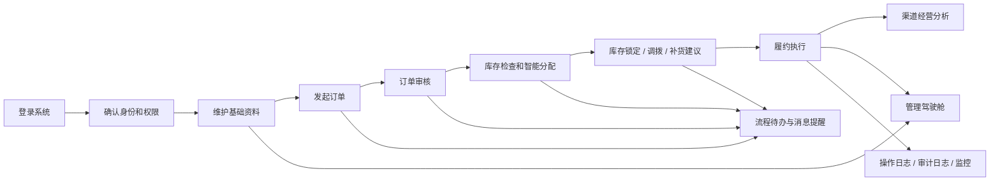

# 全汉语业务逻辑流程讲解手册（实习生版）

更新时间：2026-04-14  
适用范围：当前项目全部已挂载页面与已接入后端的主要业务链路  
适用对象：刚接触项目、没有业务基础、没有系统使用经验的实习生

---

## 1. 先用一句话讲清楚，这个系统到底是干什么的

这个系统不是一个单独的“下单页面”，也不是一个单独的“库存页面”。

它更像一个把企业日常经营串起来的平台，核心任务是：

**先把基础资料管准，再把订单跑起来，再把库存和仓库接上，再把渠道经营和管理分析看清楚，最后把审批、待办、通知、日志、监控这些配套能力补齐。**

如果用最容易理解的话来说，这个系统在做下面这件事：

1. 先确定“谁能操作系统，谁能看什么”。
2. 再确定“系统里卖的是什么、卖给谁、从哪里发、谁归谁管”。
3. 然后让业务人员发起订单。
4. 订单不能直接执行，要经过审核。
5. 审核通过后，系统会去看库存够不够、应该从哪个仓发货。
6. 如果库存不够，系统会提醒异常，或者建议补货、调拨。
7. 订单执行过程中，库存、渠道、报表、日志会一起变化。
8. 管理层最后通过驾驶舱看整体经营结果。

所以，这个系统的真正主线不是“页面”，而是下面这条业务链：

**权限 -> 基础资料 -> 订单 -> 审核 -> 分配 -> 库存 -> 履约 -> 渠道经营 -> 统计分析 -> 留痕追踪**

---

## 2. 实习生先记住四类数据

为了不把人讲晕，先不要记表名，先记住四大类数据。

### 2.1 第一类：组织权限数据

这类数据回答的是：

- 公司里有哪些部门
- 有哪些岗位
- 有哪些角色
- 有哪些用户
- 这个用户能看哪些菜单、能做哪些动作

你可以把它理解成：**谁有资格进门，谁能进哪个房间。**

### 2.2 第二类：基础资料数据

这类数据回答的是：

- 我们卖什么商品
- 商品属于什么品类
- 有哪些仓库、工厂、渠道、组织
- 有哪些经销商
- 哪个经销商能卖哪个商品
- 哪个仓库能发哪个商品

你可以把它理解成：**做生意前，先把人、货、地、关系建好。**

### 2.3 第三类：业务过程数据

这类数据回答的是：

- 订单是怎么来的
- 订单到了哪个状态
- 库存有没有被占用
- 调拨有没有做
- 有没有异常
- 是否已经发货、签收、关闭

你可以把它理解成：**真正每天在跑的经营动作。**

### 2.4 第四类：平台追踪数据

这类数据回答的是：

- 谁做了什么操作
- 哪些任务成功了，哪些失败了
- 哪些消息还没读
- 哪些审批还没处理
- 系统有没有报错
- 配置是不是改过

你可以把它理解成：**系统自己的记事本、督办本和体检报告。**

---

## 3. 整个系统的大总流程

下面这张图，建议你给实习生先讲三遍。只要这张图懂了，后面每个模块都能听明白。

这张图怎么讲：

1. 用户先登录。
2. 系统先判断你是谁，你能干什么。
3. 业务正式开始之前，要先把基础资料建好。
4. 业务人员在订单闭环中心发起订单。
5. 订单提交后进入审核。
6. 审核通过后，系统去看库存、仓库、授权关系。
7. 如果能发，就分配库存；如果不能发，就产生异常，或者建议调拨、补货。
8. 订单执行后，经营分析、渠道分析、库存分析都会同步变化。
9. 同时，流程中心、通知中心、日志中心会留下过程痕迹。

---

## 4. 先讲“人”，再讲“货”，最后讲“单”

这是培训时最好用的顺序。

### 4.1 第一层：谁在系统里做事

系统里常见的角色，可以用最朴素的话来理解：

- 系统管理员：负责建用户、建角色、配权限、配字典、看系统配置。
- 主数据管理员：负责维护商品、仓库、渠道、经销商、组织和各种关系。
- 销售或运营人员：负责发起订单、修改订单、跟订单进度。
- 审核人员：负责审核订单、审核价格、审核主数据变更。
- 仓配人员：负责看库存、做调拨、处理预警、确认出入库。
- 渠道经理：负责看经销商档案、授权、合同、价格和经营风险。
- 管理层：负责看驾驶舱、看报表、看经营结果。

### 4.2 第二层：企业到底在管什么对象

系统的核心业务对象有这些：

- 用户
- 部门
- 岗位
- 角色
- 商品
- 品类
- 仓库
- 工厂
- 渠道
- 经销商
- 组织
- 订单
- 库存
- 调拨单
- 预警
- 审批单
- 报表

### 4.3 第三层：这些对象之间是什么关系

最重要的几条关系，实习生必须记住：

1. 用户属于某个部门，挂在某个岗位下，还会绑定一个或多个角色。
2. 角色决定这个用户可以看哪些菜单、可以点哪些按钮。
3. 商品不是随便卖的，要先建商品资料，再挂品类。
4. 仓库不是万能的，不是每个仓都能发所有商品。
5. 经销商也不是万能的，不是每个经销商都能卖所有商品。
6. 订单不是来了就能发，必须检查经销授权、库存、效期、仓库能力。
7. 订单一旦进入分配，就会占用库存。
8. 库存一旦被占用，其他订单就不能重复占用同一份货。

---

## 5. 登录、找回密码、个人中心，到底在做什么

这部分很多实习生会觉得简单，但其实这是整个系统的入口。

### 5.1 登录

业务含义很简单：

- 员工输入账号和密码
- 系统验证身份
- 验证通过后，系统给这个人一张“临时通行证”
- 后续所有页面访问和按钮点击，都是拿这张“通行证”来判断能不能做

实习生要理解的关键点：

- 登录不是只为了“进系统”
- 登录的真正作用是让系统知道“你是谁”
- 系统只有知道你是谁，后面才知道给你看哪些菜单

### 5.2 找回密码

系统不是随便点一下就能改密码，而是有身份确认过程。

它的业务逻辑是：

1. 先确认这个账号存在。
2. 再做验证码校验。
3. 某些场景下还会走辅助动态码校验。
4. 验证都通过以后，才允许重置密码。

这一步的业务目的，是防止别人冒充员工改密码。

### 5.3 个人中心

个人中心不是核心业务页面，但它告诉你这个账号背后挂了什么组织信息：

- 你属于哪个部门
- 你是什么岗位
- 你有哪些角色
- 你现在是什么身份

这也是理解权限的最好入口。

---

## 6. 组织权限模块，到底在管什么

这一块不是经营动作本身，但它决定全系统能不能正常运转。

最容易讲清楚的方法，是从“公司组织架构”开始。

### 6.1 部门管理

部门管理回答的是：

- 公司有哪几个部门
- 部门之间上下级关系是什么
- 谁负责这个部门

如果部门没建好，后面岗位、用户归属、权限归属就会乱。

### 6.2 岗位管理

岗位管理回答的是：

- 这个部门里有哪些岗位
- 比如销售专员、审核专员、仓管员、渠道经理

岗位更像“工作位置”，部门更像“组织归属”。

### 6.3 角色管理

角色管理是权限体系里最重要的一层。

岗位回答“你在公司是什么位置”，角色回答“你在系统里有什么权限”。

例如：

- 销售角色可以看订单页面、创建订单
- 审核角色可以审核订单
- 仓配角色可以操作库存、调拨
- 超级管理员可以看主数据管理和平台高级页面

### 6.4 用户管理

用户管理就是把真实员工和系统身份对应起来。

它做的事包括：

- 新增账号
- 给账号分配部门
- 给账号分配岗位
- 给账号分配角色
- 启用或停用账号

### 6.5 权限管理

权限管理本质上是在定义：

- 哪个页面可以访问
- 哪个模块可以看到
- 哪个按钮可以点击

所以实习生要记住一句话：

**用户不是直接拥有权限，用户是通过角色间接拥有权限。**

### 6.6 这个模块的完整逻辑顺序

组织权限模块的推荐讲法：

1. 先建部门。
2. 再建岗位。
3. 再建角色。
4. 再建用户。
5. 最后把角色分给用户。

如果这个顺序反过来，后面会很乱。

---

## 7. 字典中心，到底有什么用

很多新人会以为字典中心不重要，其实它是很多下拉选项、状态值、类型值的来源。

字典可以理解为：

**系统里那些会反复使用、需要统一口径的小标准。**

比如：

- 状态类型
- 分类类型
- 风险级别
- 周期类型

为什么要有字典中心：

1. 不让每个页面各写一套叫法。
2. 保证全系统口径统一。
3. 后期改名字时，只改一处就行。

给实习生讲时，可以把它比喻成：

**公司统一的词典。**

---

## 8. 主数据管理，到底是在“打地基”

这一部分是整个系统的地基。如果地基不准，订单、库存、渠道、驾驶舱都会错。

所以你可以直接告诉实习生：

**主数据不是辅助模块，主数据是所有业务模块的前提。**

### 8.1 商品和品类

这里回答的是：

- 我们卖什么商品
- 这个商品叫什么
- 商品编码是什么
- 它属于哪个品类
- 它现在是有效、停用，还是生命周期结束

实习生一定要懂：

- 品类是大类
- 商品是具体卖的东西
- 如果商品停用了，订单里就不应该再继续卖

### 8.2 仓库和工厂

这里回答的是：

- 货从哪里生产出来
- 货现在放在哪个仓
- 哪个仓负责哪个区域

工厂更偏“产地”，仓库更偏“发货点”。

### 8.3 渠道和经销商

这里回答的是：

- 是通过什么渠道卖货
- 货卖给哪个经销商
- 这个经销商归哪个渠道、哪个区域

渠道像“大路径”，经销商像“具体客户”。

### 8.4 组织和业务日历

组织是经营分析时的重要维度，业务日历则告诉系统：

- 哪天是工作日
- 哪天是节假日
- 某些业务周期怎么解释

### 8.5 关系配置为什么非常重要

主数据里最容易被忽视，但最关键的是“关系”。

因为真正业务里，系统不是只看对象本身，还要看对象之间能不能搭起来。

最重要的关系有四类：

1. 仓库和商品的关系  
意思是：这个仓到底能不能发这个货。

2. 商品和经销商的关系  
意思是：这个经销商到底有没有资格卖这个货。

3. 组织和经销商的关系  
意思是：这个经销商到底归哪个组织负责。

4. 产品和商品的转换关系  
意思是：分析、生产、经营口径之间怎么换算。

### 8.6 主数据为什么会影响所有业务页面

因为主数据一变，下游页面都跟着变。

举例：

- 新增一个商品后，订单页面才能选到它。
- 关闭一个商品后，订单校验就可能不通过。
- 改了经销授权后，订单可能会变成越权销售。
- 改了仓库和商品关系后，订单分配仓库的结果也会变。

所以主数据不是“后台维护一下就完了”，它会直接改变经营过程。

---

## 9. 主数据治理平台，到底是在管“变更是否合规”

前面的主数据管理更像“直接维护资料”。

主数据治理平台更像“给资料变更加流程、加审核、加版本、加质检”。

它解决的问题是：

- 谁都能改主数据，会很乱
- 改错了会影响很多业务
- 改完以后没人知道是谁改的
- 改完以后也不知道影响了谁

所以这里不是简单录数据，而是在做“治理”。

### 9.1 申请审批

业务逻辑是：

1. 发起人提出变更申请。
2. 申请里写清楚改什么、为什么改。
3. 提交以后进入待审批状态。
4. 审核人决定通过还是驳回。
5. 通过后，变更正式生效。
6. 驳回后，可以修改后重新提。

这就像公司内部的正式变更单。

### 9.2 版本追溯

版本追溯回答的是：

- 这个对象以前长什么样
- 现在长什么样
- 第几次被改过
- 是谁改的
- 什么时候生效的

它的价值是：

**出问题时能回头查。**

### 9.3 生效期治理

有些关系不是永远有效的，比如经销授权。

所以系统要看：

- 开始日期是什么
- 结束日期是什么
- 现在是未生效、已生效、快到期，还是已过期

这一点特别适合给实习生讲“为什么有些订单今天能下，明天就不行了”。

### 9.4 质量规则

质量规则的意思不是“人觉得差不多就行”，而是系统用固定规则检查数据好不好。

例如：

- 编码是否唯一
- 名称是否必填
- 时间范围是否合理
- 引用对象是否存在
- 跨对象关系是否完整

### 9.5 冲突检测

冲突检测是在找“逻辑上打架的数据”。

例如：

- 同一个授权时间重叠
- 同一个关系重复存在
- 某个仓应该有这个商品关系，但实际缺了

### 9.6 引用与停用

这是实习生最容易忽略的一点。

一个对象不是想停就停，因为它可能已经被订单、库存、调拨、关系数据引用了。

所以停用之前，系统会先看：

- 有没有订单在用它
- 有没有库存在用它
- 有没有关系在用它
- 有没有调拨在用它

如果引用很多，停用风险就高。

---

## 10. 订单闭环中心，是整个业务主链的核心

如果只给实习生讲一个业务模块，优先讲这个。

因为它最能体现“企业经营系统”到底在干什么。

### 10.1 订单闭环中心不是普通下单页

它不是填完单子就结束，而是把订单从创建到关闭的全过程串起来。

它包括：

- 建单
- 编辑
- 提交审核
- 审核通过或驳回
- 分配仓库
- 识别异常
- 生成补货建议
- 跟踪履约状态
- 最后关闭订单

所以它叫“闭环中心”。

### 10.2 订单为什么要分成订单头和订单行

给实习生可以这么讲：

- 订单头是这张单子的总体信息
- 订单行是这张单子里每一种商品的明细

比如：

- 订单头记录客户、区域、渠道、订单来源、总金额
- 订单行记录每个商品的编码、数量、单价、建议发货仓

这样做的原因是：一张订单往往不止一个商品。

### 10.3 建单时系统在做什么

业务人员新建订单时，系统不是只保存文字。

系统会同时做这些检查：

1. 客户是不是有效客户。
2. 订单来源是不是合法。
3. 订单行是不是为空。
4. 商品是不是有效商品。
5. 数量是不是大于零。
6. 这个经销商有没有卖这个商品的授权。
7. 这个客户有没有默认发货仓。

如果这些基础条件不满足，订单一开始就会报错。

### 10.4 订单状态为什么这么多

订单在系统里不是只有“有”或“没有”，而是会经历很多状态。

最常见的主状态可以这样理解：

- 草稿：刚建好，还没正式提审
- 待审核：已经提交，等人审批
- 已通过：审批通过，可以往后走
- 已驳回：审批没过，退回修改
- 已关闭：订单流程结束

除此之外，还有履约状态，用来表示执行进度：

- 待分配
- 已分配
- 待出库
- 已出库
- 运输中
- 已签收
- 异常中
- 已关闭

### 10.5 提交审核时发生了什么

业务上，这一步表示：

“这个订单不是我自己说了算，我提交给审核人确认。”

系统上，这一步表示：

1. 订单从草稿转成待审核。
2. 系统记录一次审核轨迹。
3. 日志里会留下提交动作。
4. 驾驶舱里的订单状态分布也会变化。

### 10.6 审核通过和驳回时发生了什么

#### 审核通过

表示这张订单可以进入执行阶段。

系统会：

- 把订单状态改成已通过
- 让它进入可分配阶段
- 继续往库存和仓配环节走

#### 审核驳回

表示这张订单暂时不能执行，要回去改。

系统会：

- 把订单退回
- 记录驳回意见
- 如果之前占过库存，还要把占用释放掉

### 10.7 智能分配到底在分什么

分配的本质是：

**决定这张订单里的货，到底从哪个仓发。**

系统不是乱选仓，而是综合考虑这些因素：

- 库存够不够
- 仓库距离是否合适
- 商品鲜度好不好
- 成本高不高
- 仓库优先级如何

所以分配的结果，本质上是一个“发货方案”。

### 10.8 异常处置到底在处理什么

如果订单不能顺利分配，就会进入异常处置。

常见异常包括：

- 库存不足
- 商品效期风险
- 安全库存透支风险
- 锁定库存不能重复占用
- 超区域授权
- 超经销授权
- 没有默认仓
- 没有可匹配关系

异常处置页面的意义，不是看热闹，而是让人去：

- 认领异常
- 分析原因
- 处理异常
- 关闭异常

### 10.9 履约跟踪到底在跟踪什么

审核通过、分配成功以后，订单还没有结束。

因为企业真正关心的是：

- 货有没有出库
- 货有没有在路上
- 客户有没有签收
- 中间有没有异常

所以履约跟踪就是在看订单执行到哪一步了。

### 10.10 订单闭环中心的完整业务顺序

培训时建议按这个顺序讲：

1. 新建订单
2. 编辑订单
3. 提交审核
4. 审核通过或驳回
5. 自动或人工分配
6. 处理异常
7. 看补货建议
8. 跟踪履约
9. 关闭订单

只要这九步讲清楚，整个业务主链就清楚了。

---

## 11. 库存与仓配运营中心，是订单执行的底座

如果说订单中心负责“要货”，那库存与仓配中心负责“有没有货、货怎么动”。

### 11.1 库存台账

库存台账是最核心的库存视图。

它回答的是：

- 哪个仓有多少货
- 哪个商品属于哪个批次
- 生产日期是什么
- 到期日期是什么
- 现在还能卖几天
- 多少是可用库存
- 多少是锁定库存
- 多少是在途库存

实习生要记住：

**库存台账不是简单数量表，它是“按仓库、按商品、按批次、按效期”的立体库存。**

### 11.2 出入库流水

出入库流水是库存变化记录。

只要库存动了，就应该能在这里找到原因。

常见类型包括：

- 入库
- 出库
- 调出
- 调入
- 锁定
- 释放
- 调整
- 损耗

所以如果有人问“这个库存为什么少了”，第一时间看流水。

### 11.3 调拨单

调拨的意思是：

一个仓不够，另一个仓有多，就把货在仓之间挪动。

调拨单的完整逻辑一般是：

1. 建调拨单
2. 提交审核
3. 审核通过
4. 调出确认
5. 调入确认
6. 调拨完成

如果中间不想做了，也可以取消。

### 11.4 预警中心

库存预警不是“出了问题再看”，而是系统主动提醒风险。

常见预警包括：

- 低库存
- 高库存
- 临期库存
- 缺货

预警中心的目的，是让仓配和运营提前处理，而不是等订单出问题再补救。

### 11.5 仓配能力

仓库不是只有库存数量，还有服务能力。

仓配能力页面主要在看：

- 这个仓能服务哪些区域
- 日处理能力有多大
- 分拣能力有多大
- 配送时效是多少
- 能支持多少商品

这一步很重要，因为“有货”不等于“能及时发出去”。

### 11.6 锁定记录

锁定记录回答的是：

哪一张订单，占用了哪一批库存。

这非常关键，因为：

- 订单分配成功后，库存不能再被别人抢走
- 如果订单取消或驳回，就要把锁释放掉

所以锁定记录是订单和库存之间最直接的桥梁。

### 11.7 库存模块和订单模块怎么联动

这是讲库存时一定要说清楚的重点。

联动逻辑是：

1. 订单通过审核后，进入可分配阶段。
2. 系统尝试从库存里找到合适的货。
3. 找到以后，不是马上减少总库存，而是先锁定可用库存。
4. 锁定后，别的订单就不能重复占用。
5. 真正出库时，再把库存正式扣减。
6. 如果订单取消或失败，就把锁释放回去。

---

## 12. 渠道与经销商经营中心，是“客户经营”的主阵地

订单中心更关注“单子怎么跑”，渠道经营中心更关注“客户和渠道怎么管”。

它主要分成六块。

### 12.1 经销商档案中心

这里是在维护经销商的经营档案。

主要信息包括：

- 经销商是谁
- 在哪个区域
- 属于哪个渠道
- 销售范围是什么
- 联系人是谁
- 客户经理是谁
- 信用等级如何
- 默认发货仓是什么

这相当于客户的“经营身份证”。

### 12.2 授权管理升级

授权管理的本质是：

**规定某个经销商可以在什么范围内卖什么货。**

通常会管这些内容：

- 授权商品
- 授权区域
- 授权渠道
- 生效开始时间
- 生效结束时间
- 当前授权状态

为什么这一步很关键：

因为订单不是想卖给谁就卖给谁。

如果超范围卖货，就会被识别成越权销售风险。

### 12.3 合同周期管理

企业合作不是口头说说，要有合同周期。

合同模块回答的是：

- 合同编号是什么
- 合同从什么时候开始
- 什么时候结束
- 现在是合作中、暂停，还是结束
- 是否需要续签

这一步的意义是：防止合同到期了还继续按老规则做生意。

### 12.4 价格政策管理

不同经销商、不同渠道、不同商品，价格可能不一样。

价格政策模块主要在做：

- 维护价格等级
- 维护商品价格
- 设定价格生效期
- 提交价格审批
- 审批通过后才正式生效

实习生要明白：

价格不是随手改一下就完了，它往往也要走审批。

### 12.5 渠道销量分析

这一块不是录数据，而是看经营结果。

它一般关心：

- 哪个区域卖得多
- 哪个经销商卖得好
- 哪个渠道贡献大
- 哪个商品卖得多
- 和上一个周期相比是涨还是跌

所以它更偏“经营分析”。

### 12.6 经营风险识别

系统会根据经营行为识别风险。

常见风险有：

- 长期低销量
- 高频异常下单
- 越权销售
- 合同快到期

风险识别的目的不是吓人，而是让业务人员提前跟进。

### 12.7 渠道模块和订单模块怎么联动

这是培训时必须讲透的地方。

联动逻辑是：

1. 订单发生后，会形成真实销售事实。
2. 这些销售事实会进入渠道经营分析。
3. 如果订单超出了经销授权范围，系统会识别成越权风险。
4. 合同、价格、授权等信息也会反过来影响订单是否合理。

所以渠道中心不是独立页面，它是吃订单结果、反过来又约束订单过程的模块。

---

## 13. 牧场与奶源运营中心，当前更偏供应端分析

这个模块从业务上讲，应该负责供应端，也就是奶源侧的运行情况。

### 13.1 从业务角度，它应该关注什么

可以这样理解：

- 牧场今天产了多少
- 奶源质量怎么样
- 有没有温控异常
- 奶源能不能支撑后面的订单需求

### 13.2 当前版本里，它更像什么

当前版本更偏“概览和分析展示”，也就是让人看到供应端情况，而不是完整执行系统。

所以培训时要实话实说：

**这个模块目前更偏看板和统计，不像订单、库存那样已经是完整主链。**

### 13.3 为什么它仍然重要

因为从业务逻辑上，它代表的是供应链前端。

如果后面继续深化，这个模块会和下面这些动作更强关联：

- 产量日报
- 质量记录
- 发运计划
- 冷链温控异常
- 供应预测

---

## 14. 流程协同与待办中心，是“催着大家把事做完”的地方

这个模块不是直接做业务，而是把各类待处理事项集中起来。

它可以理解成系统里的“任务中枢”。

### 14.1 我的待办

我的待办回答的是：

- 现在有哪些事情等我处理
- 哪些最紧急
- 哪些快超时
- 点进去该跳到哪个业务页面

常见待办包括：

- 订单待审核
- 主数据待审批
- 调拨待审核
- 异常待处理
- 失败任务待查看

### 14.2 我的已办

已办不是没用的历史记录，而是用来回答：

- 我以前处理过什么
- 我什么时候处理的
- 处理意见是什么

### 14.3 消息中心

消息中心负责统一站内提醒。

比如：

- 你有新的待办
- 某任务执行失败
- 某审批已经到你这里
- 某导入导出任务完成

### 14.4 审批中心

审批中心是把不同业务的审批统一管理。

也就是说，不管你审批的是：

- 订单
- 主数据
- 调拨
- 价格

理论上都可以在这里汇总看。

### 14.5 任务中心

任务中心主要看系统运行任务。

比如：

- 导入任务
- 导出任务
- 同步任务
- 批处理任务

如果任务失败，往往也会出现在待办里。

### 14.6 催办与超时提醒

现实业务里，很多事情不是没人做，而是拖着没做。

这个模块的作用是：

- 超时前提醒
- 超时后催办
- 再不处理就升级提醒

所以你可以把它理解成：

**系统里的督办秘书。**

---

## 15. 经营分析与管理驾驶舱，是给管理层看的结果页

前面的模块大多是在“做业务”。

驾驶舱主要是在“看结果”。

### 15.1 它不是原始数据页，而是经营总结页

管理层通常不关心某一张订单某一行字段怎么填。

他们更关心的是：

- 总共做了多少订单
- 审核通过率是多少
- 分配成功率是多少
- 履约率怎么样
- 库存是否健康
- 渠道贡献如何
- 主数据质量是不是在拖后腿

所以驾驶舱是“把分散的数据总结成管理视角”。

### 15.2 订单分析看板

这一页主要回答：

- 订单有多少
- 订单总量有多少
- 订单总金额有多少
- 审核通过率如何
- 分配成功率如何
- 按区域和渠道看分布是什么样

### 15.3 库存分析看板

这一页主要回答：

- 库存周转快不快
- 临期库存多不多
- 缺货商品多不多
- 预警有没有积压
- 仓库负载是否均衡
- 调拨状态怎么样

### 15.4 渠道经销商分析

这一页主要回答：

- 哪些渠道贡献大
- 哪些经销商排名靠前
- 哪些区域卖得好
- 授权执行率如何

### 15.5 主数据质量看板

这一页主要回答：

- 基础资料错得多不多
- 冲突多不多
- 快失效的数据多不多
- 审批有没有积压

### 15.6 专题报表中心

这一页是把分析结果沉淀成正式报表。

它通常支持：

- 生成日报
- 生成周报
- 生成月报
- 导出
- 留档

这一步对管理层和复盘特别重要。

---

## 16. 平台支撑模块，是系统的“后台保障”

这一组页面看起来不如订单、库存直观，但对企业系统非常重要。

### 16.1 操作日志

操作日志关注的是：

- 谁做了什么操作
- 什么时间做的
- 操作对象是什么

这是日常追责和排查的基础。

### 16.2 审计日志

审计日志比操作日志更强调“变化前后”。

也就是说，它不仅记得谁改了，还会记得：

- 改前是什么
- 改后是什么

适合查配置变更、主数据变更、订单关键动作。

### 16.3 登录日志与安全中心

这里主要看安全事件，比如：

- 登录成功
- 登录失败
- 风险登录
- 权限相关敏感动作

### 16.4 系统配置中心

系统配置中心是在管那些会影响系统运行规则的配置。

比如：

- 某些阈值
- 某些开关
- 某些策略参数

配置不是随便改的，改完通常也会留版本。

### 16.5 数据归档策略

不是所有历史数据都要一直放在热数据里。

归档策略要回答：

- 哪些数据该归档
- 什么时候归档
- 归档后怎么查

### 16.6 接口与任务监控

监控页面主要看：

- 接口调用量
- 错误率
- 慢接口
- 任务成功率

如果系统“感觉变慢了”，第一时间就该来这里看。

### 16.7 权限精细化控制

这一页不是只控制“能不能进页面”，还可能控制：

- 能不能看到某个按钮
- 能不能看某些字段
- 能不能看某些数据范围

### 16.8 系统健康视图

健康视图更像系统体检报告。

它会综合看：

- 服务状态
- 存储状态
- 错误情况
- 任务运行情况

### 16.9 导入任务与导出任务

这两个页面很适合给新人讲“系统不只是录单，也要做批量数据交换”。

导入任务回答：

- 这次导入有没有成功
- 哪一行报错了
- 错在哪里

导出任务回答：

- 哪次导出完成了
- 导出了什么内容
- 能不能下载

---

## 17. 智能订购中心，当前是旧链路展示页

这个地方在培训时一定要单独提醒，不然新人最容易走错地方。

### 17.1 它看起来像下单页，但当前不是主入口

当前版本里，真正的新订单创建主入口是：

**订单闭环中心**

而不是：

**智能订购中心**

### 17.2 那智能订购中心现在是干什么的

当前更偏：

- 旧链路分析
- 地图展示
- 旧版订单相关展示

所以给实习生讲的时候，一定要明确说：

**现在做正式订单业务，统一去订单闭环中心。**

---

## 18. 一张订单从头到尾，到底经历了什么

这一段最适合培训现场照着念。

### 18.1 第一步：业务人员建单

业务人员在订单闭环中心新建订单，填写：

- 客户
- 区域
- 渠道
- 商品
- 数量
- 价格
- 希望发货仓

### 18.2 第二步：系统做基础校验

系统马上检查：

- 客户是不是有效
- 商品是不是有效
- 授权是否存在
- 数量是否合理
- 默认仓是否存在

如果这里就不通过，订单连审核都进不去。

### 18.3 第三步：订单提交审核

业务人员确认没问题后，提交审核。

这表示：

“这张单我先提上来，请审核人员确认能不能继续执行。”

### 18.4 第四步：审核人员处理

审核人员可以：

- 通过
- 驳回

通过后，订单进入可执行阶段。  
驳回后，订单退回修改。

### 18.5 第五步：系统进行分配

订单通过后，系统会看：

- 哪个仓有货
- 哪个仓更合适
- 是否存在效期风险
- 是否会压穿安全库存

然后给出分配方案。

### 18.6 第六步：库存被锁定

一旦分配成功，库存先被锁住。

这一步不是正式出库，而是先“占坑”。

作用是：

- 防止别的订单抢走这批货

### 18.7 第七步：如果不顺利，就进入异常

如果库存不够、授权不对、没有匹配仓，系统就会生成异常。

异常人员需要去处理：

- 是不是改单
- 是不是调拨
- 是不是补货
- 是不是关闭异常

### 18.8 第八步：履约推进

如果订单继续执行，就会进入：

- 待出库
- 已出库
- 运输中
- 已签收

### 18.9 第九步：经营和分析同步变化

订单变化以后，下面这些地方都会跟着动：

- 库存台账
- 锁定记录
- 渠道分析
- 驾驶舱
- 操作日志
- 审计日志
- 监控指标

### 18.10 第十步：订单关闭

当这张订单走完流程，系统把它关掉。

如果有未释放锁定，也应该在这个阶段处理干净。

---

## 19. 新人最容易混淆的几组概念

培训时建议专门讲这一节。

### 19.1 部门、岗位、角色

- 部门：你属于哪个公司结构里的哪一块
- 岗位：你在部门里做什么工作
- 角色：你在系统里能干什么

### 19.2 商品、品类、产品

- 品类：大的分类
- 商品：实际卖的具体对象
- 产品：有时是经营或生产口径上的上层概念

### 19.3 仓库、工厂、发货仓

- 工厂：生产出来的地方
- 仓库：存货和发货的地方
- 发货仓：这张订单最终从哪个仓发

### 19.4 可用库存、锁定库存、在途库存

- 可用库存：现在还能分给订单的货
- 锁定库存：已经被订单占住了，别人不能再用
- 在途库存：货已经在路上，还没正式到位

### 19.5 草稿、待审核、已通过、已关闭

- 草稿：自己还在编辑
- 待审核：交给别人确认
- 已通过：可以往后执行
- 已关闭：流程已经结束

### 19.6 操作日志和审计日志

- 操作日志：谁做了什么
- 审计日志：改前改后有什么变化

---

## 20. 给实习生讲系统时，推荐按这个顺序带

这是最不容易把人讲乱的顺序。

### 20.1 第一天讲什么

先讲全局，不讲细节。

建议顺序：

1. 系统是干什么的
2. 四类数据是什么
3. 各类角色是谁
4. 整个业务总流程

### 20.2 第二天讲什么

讲“地基”和“权限”。

建议顺序：

1. 部门、岗位、角色、用户
2. 字典中心
3. 主数据管理
4. 主数据关系

### 20.3 第三天讲什么

讲真正业务主链。

建议顺序：

1. 订单闭环中心
2. 库存与仓配运营中心
3. 渠道与经销商经营中心

### 20.4 第四天讲什么

讲协同和结果。

建议顺序：

1. 流程协同与待办中心
2. 经营分析与管理驾驶舱
3. 平台日志、监控、导入导出

---

## 21. 如果实习生只记住五句话，就让他记这五句

1. 这个系统先管权限，再管基础资料，再跑业务。
2. 订单闭环中心是现在真正的订单主入口。
3. 订单能不能往下走，取决于授权、库存、仓库和审核。
4. 库存不是一个总数，而是按仓、按批次、按效期、按状态管理的。
5. 驾驶舱看到的是结果，日志和流程中心看到的是过程。

---

## 22. 给带教老师的讲解口径建议

如果你要给完全不会的实习生讲，不建议一上来就讲代码、接口、表名。

最好的讲法是：

### 22.1 先讲“公司为什么要有这个系统”

不要先讲功能，先讲场景。

比如：

- 公司有很多人做事，必须先知道谁能做什么。
- 卖货之前要先知道卖什么、卖给谁、谁能卖。
- 订单来了以后不能拍脑袋发货，要看库存和授权。
- 做完以后管理层还要看结果，系统还要留痕。

### 22.2 再讲“每个模块像现实中的哪个部门”

例如：

- 组织权限模块像人事加信息部
- 主数据模块像资料中心
- 订单中心像销售运营台
- 库存模块像仓库和调度中心
- 渠道模块像客户经营中心
- 流程中心像督办中心
- 驾驶舱像总经理报表台

### 22.3 最后再讲“页面里怎么点”

只有业务逻辑先懂了，页面操作才不会死记硬背。

---

## 23. 当前版本里，需要提前告诉实习生的边界

为了避免误解，下面这些口径建议在培训时直接说清楚。

1. 智能订购中心当前更偏旧链路展示，不是正式建单主入口。
2. 订单闭环中心才是当前订单主链。
3. 牧场与奶源模块当前更偏分析展示，不是完整执行链。
4. 流程中心目前已经能承接待办、消息、审批、任务，但并不是所有业务动作都自动流入。
5. 主数据治理平台已经具备申请、审批、版本、质检、冲突、引用检查能力，但后续还可以继续加强。

---

## 24. 最后一段总结，适合当培训开场白

你可以直接把下面这段念给实习生听：

这个系统可以理解成一家企业经营过程的缩影。  
它先解决“谁能做事”，再解决“拿什么做事”，然后解决“事情怎么流转”，最后解决“结果怎么看、过程怎么追”。  
你在系统里看到的每一个页面，其实都不是孤立存在的。  
主数据会影响订单，订单会影响库存，库存会影响履约，履约会影响渠道经营，所有过程又会被日志、待办、消息、报表记录下来。  
所以学这个系统，不是背页面名字，而是先理解业务链条。只要明白“人、货、单、仓、渠道、流程、分析”这七件事，整个项目就能听懂八成。

---

## 25. 培训时最推荐演示的一条实操链

如果你只准备演示一条流程，建议演示这一条：

1. 用一个有权限的账号登录系统。
2. 到主数据里先看商品、仓库、经销商和授权关系。
3. 去订单闭环中心新建一张订单。
4. 提交审核。
5. 审核通过。
6. 执行分配。
7. 去库存中心看锁定记录和库存变化。
8. 去渠道中心看销量或风险变化。
9. 去驾驶舱看统计变化。
10. 去日志、审计、监控里看痕迹。

这一条走完，实习生基本就能明白整个系统不是“很多散页面”，而是一条完整的业务链。
